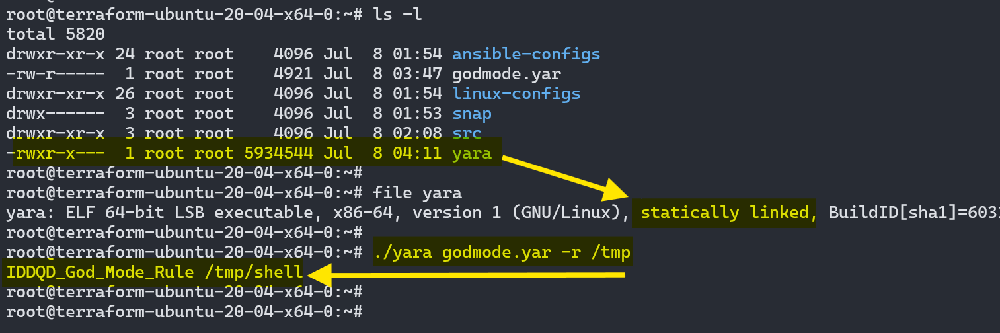

# Atomic Red Team x Unix Artifacts Collector

An overview of spinning up a test environment, and extracting evidence from any unix-like endpoint. This is mostly for personal reference, as it's just pointing to all the existing (and vast) documentation in a sequence that's useful for me -- and hopefully for you as well.

*Updated on 2024/07/12.*

<!-- more -->

!!! abstract "Deploy, Attack, Detect"

	This covers topics in the following order:

	- Creating a "tester" node used to execute atomics remotely towards "target" nodes.
	- Connecting to targets via PSRemoting over SSH
	- Compiling static binaries for `coreutils`, ~~`binutils`~~, `chkrootkit`, `rkhunter`, and `yara` to use with `uac`.
	- Collecting artifacts from "target" nodes.
	- Sorting through artifacts

	In these tests, static binaries were compiled on an Ubuntu 22.04 server, and copied to an Ubuntu 20.04 server for use.

Before getting started, you can follow the steps below or use any of the Ansible roles built while writing this post to deploy everything and refer to this post should you encounter any issues.

!!! tip "Automate Deployment with Ansible"

	Much of this has been automated with my Ansible roles:

	- [build_atomic_node](https://github.com/straysheep-dev/ansible-configs/tree/main/build_atomic_node): Deploy both a "tester" and "targets" using groups in your inventory file
	- [manage_keys](https://github.com/straysheep-dev/ansible-configs/tree/main/manage_keys): Deploy or revoke SSH private and public keys on endpoints
	- [deploy_uac](https://github.com/straysheep-dev/ansible-configs/tree/main/deploy_uac): Drop UAC on each endpoint using groups in your inventory file


## Install Invoke-AtomicRedTeam

[Invoke-AtomicReadTeam](https://github.com/redcanaryco/invoke-atomicredteam) is an execution framework in PowerShell to run [Atomic Tests](https://github.com/redcanaryco/atomic-red-team/wiki/Getting-Started#choose-a-test), which are adversary emulation tests mapped to MITRE ATT&CK.

There are two clean and easy ways to do this.


**Windows Sandbox (Hyper-V)**

Basically all you need is the `.wsb` file, just execute it with PowerShell like: `PS> .\art.wsb` to start Windows Sandbox with Atomic Red Team provisioned.

- [WSB Config File](https://github.com/redcanaryco/invoke-atomicredteam/blob/master/sandbox/art.wsb): Double-clicking the file or executing with PowerShell will spawn a Windows Sandbox instance.
- [Setup Script](https://github.com/redcanaryco/invoke-atomicredteam/blob/master/sandbox/setupsandbox.ps1): The WSB file executes PowerShell within the sandbox to retrieve this script and execute it, installing ART.


!!! info "Windows Sandbox: How Does It Work?"

	[Windows Sandbox](https://straysheep.dev/blog/2024/05/08/windows/#windows-sandbox) is a temporary, Hyper-V-isolated environment. Any changes made here will not directly affect your host. Of course if you can ping your host's network interface from the Sanbox, be aware of exposure there. There's a setting called [Protected Client mode](https://learn.microsoft.com/en-us/windows/security/application-security/application-isolation/windows-sandbox/windows-sandbox-configure-using-wsb-file#protected-client), which (to my understanding) further isolates the RDP-like Sandbox process that runs on your "host" desktop environment through which you interact with the sandbox instance. Windows Sandbox itself is still running as it's own Hyper-V isolated environment separate from your host in either case. You may also want to adjust other settings in the wsb file, which are [detailed here](https://learn.microsoft.com/en-us/windows/security/application-security/application-isolation/windows-sandbox/windows-sandbox-configure-using-wsb-file).


**Linux Server (terraform, vagrant, proxmox)**

*This is the route I went. Using PowerShell on Linux for the examples below, and for better or worse you can run as root on the tester node for simplicity.*

- [Spin up a Linux server (locally with proxmox, vagrant, or in the cloud)](https://github.com/straysheep-dev/terraform-configs)
- [Install PowerShell (using Ansible)](https://github.com/straysheep-dev/ansible-configs/tree/main/install_powershell)
- [Install the execution framework **AND** atomics folder](https://github.com/redcanaryco/invoke-atomicredteam/wiki/Installing-Invoke-AtomicRedTeam#install-execution-framework-and-atomics-folder)

In summary, once you're SSH'd into your Linux machine, start PowerShell and install Atomic Red Team with:

=== "PowerShell"

	```powershell
	pwsh  # Start PowerShell
	IEX (IWR 'https://raw.githubusercontent.com/redcanaryco/invoke-atomicredteam/master/install-atomicredteam.ps1' -UseBasicParsing);
	Install-AtomicRedTeam -getAtomics -Force
	```


## Provision Targets

On the "target" machines, the following changes must be made to [allow PSRemoting over SSH](https://learn.microsoft.com/en-us/powershell/scripting/security/remoting/ssh-remoting-in-powershell?view=powershell-7.4).

**Linux**

This assumes sshd is already running and configured.

=== "Bash"

	```bash
	echo 'Subsystem powershell sudo /usr/bin/pwsh -sshs -NoLogo' | sudo tee -a /etc/ssh/sshd_config
	sudo systemctl restart sshd
	```

**Windows**:

- [Install OpenSSH Server](https://github.com/straysheep-dev/windows-configs/blob/main/Manage-OpenSSHServer.ps1)
- [Install the latest version of PowerShell (7.X+)](https://learn.microsoft.com/en-us/powershell/scripting/install/installing-powershell-on-windows?view=powershell-7.4#install-powershell-using-winget-recommended) `winget install --id Microsoft.Powershell --source winget`
- Confirm `SSHHost` and `SSHHostHashParam` are available with `(Get-Command New-PSSession).ParameterSets.Name`
- Append the subsystem configuration to sshd_config

=== "PowerShell"

	```powershell
	echo 'Subsystem powershell c:/progra~1/powershell/7/pwsh.exe -sshs -nologo' | Out-File -Path $env:ProgramData\ssh\sshd_config -Encoding ASCII -Append
	Restart-Service sshd
	```

With that, each endpoint is ready for executing atomic tests.


## Running Tests

The [documentation for Invoke-AtomicTest is extensive](https://github.com/redcanaryco/invoke-atomicredteam/wiki), and you can [browse individual tests per-OS in the wiki](https://github.com/redcanaryco/atomic-red-team/wiki/Getting-Started#choose-a-test). I suggest walking through each section of the [invoke-atomicredteam wiki](https://github.com/redcanaryco/invoke-atomicredteam/wiki) first.

- [`-ShowDetailsBrief`](https://github.com/redcanaryco/invoke-atomicredteam/wiki/List-Atomic-Tests#show-details-brief) will list the names of each test.
- [`-ShowDetails`](https://github.com/redcanaryco/invoke-atomicredteam/wiki/List-Atomic-Tests#show-details-verbose) is best used to learn more about a single technique.
- [`-CheckPrereqs`](https://github.com/redcanaryco/invoke-atomicredteam/wiki/Check-or-Get-Prerequisites-for-Atomic-Tests) will see if the system has the components to execute the tests.
- [`-GetPrereqs`](https://github.com/redcanaryco/invoke-atomicredteam/wiki/Check-or-Get-Prerequisites-for-Atomic-Tests#get-prerequisites) will attempt to obtain missing prerequisites, for example compiling the requires source code for the test.
- [Executing Atomics Locally](https://github.com/redcanaryco/invoke-atomicredteam/wiki/Execute-Atomic-Tests-(Local))
- [Executing Atomics Remotely](https://github.com/redcanaryco/invoke-atomicredteam/wiki/Execute-Atomic-Tests-(Remote))

The last item above is what we want to replicate. It links to the [Microsoft documentation for enabling PSRemoting over SSH](https://docs.microsoft.com/en-us/powershell/scripting/learn/remoting/ssh-remoting-in-powershell-core). By terraforming multiple cloud / proxmox servers, and installing PowerShell with Ansible, we're nearly done.

From your atomic red team "tester" node, Import the module (on a Linux tester node):

=== "PowerShell"

	```powershell
	Import-Module "/root/AtomicRedTeam/invoke-atomicredteam/Invoke-AtomicRedTeam.psd1" -Force
	```

Create an SSH key and distribute the public key to each target node.

=== "Bash"

	```bash
	ssh-keygen -t ed25519 -f ~/.ssh/id_ed25519 -q -N ""

	# Append this to ~/.bashrc
	if [ -f $HOME/.ssh/id_ed25519 ]; then
		eval $(ssh-agent -s)
		ssh-add ~/.ssh/id_ed25519
	fi
	```

!!! tip "Deploying Keys"

	[manage_keys](https://github.com/straysheep-dev/ansible-configs/tree/main/manage_keys) can help do this.

Open a PSRemoting Session from the tester node *to* the target node(s):

=== "PowerShell"

	```powershell
	$sess = New-PSSession -HostName <target-ip> -Username root -KeyFilePath ~/.ssh/id_ed25519
	```

To execute all Linux rootkit tests againts the remote target:

=== "PowerShell"

	```powershell
	Invoke-AtomicTest T1014 -ShowDetailsBrief -Session $sess
	Invoke-AtomicTest T1014 -GetPrereqs -Session $sess
	Invoke-AtomicTest T1014 -CheckPrereqs -Session $sess
	Invoke-AtomicTest T1014 -Session $sess
	```

This example focuses on techniques T1014-3 and T1014-4.


## Compiling Static Binaries

[`uac` will use any binaries in the following folder(s)](https://tclahr.github.io/uac-docs/#using-your-binary-files) instead of the system's binaries. This gives you the option to compile static binaries from a trusted host for use on a compromised system.

=== "PowerShell"

	```powershell
	# [uac_directory]\bin\linux\x86_64\chkrootkit
	New-Item -Path ~/uac/uac-$uac_version/bin/linux/x86_64 -Type Directory -Force
	```

=== "Bash"

	```bash
	mkdir -p ~/uac/uac-$uac_version/bin/linux/x86_64
	```

!!! note "Strategy and Reasoning"

	The following five seem like the first candidates for static binaries to bring to a compromised system during IR:

	- coreutils ✅
	- binutils ⚠️
	- chkrootkit ✅
	- rkhunter ❔
	- yara ✅

	Ideally you'd be doing this from a mounted forensic image of a system that's been taken offline. In this case we'll assume you have to do this on a live system currently under adversary control.

### Prepare Environment

**Ubuntu**

Enable the source repositories, and install any missing development packages (this is based on my test with Ubuntu 22.04 server).

=== "PowerShell"

	```powershell
	New-Item -Path ~/src -Type Directory
	sudo sed -i_bkup 's/# deb-src/deb-src/g' /etc/apt/sources.list
	sudo apt update
	# Essentials
	sudo apt install -y make automake texinfo flex
	# For yara
	sudo apt install -y bison libtool pkg-config libprotobuf-c-dev libssl-dev
	```

=== "Bash"

	```powershell
	mkdir ~/src
	sudo sed -i_bkup 's/# deb-src/deb-src/g' /etc/apt/sources.list
	sudo apt update
	# Essentials
	sudo apt install -y make automake texinfo flex
	# For yara
	sudo apt install -y bison libtool pkg-config libprotobuf-c-dev libssl-dev
	```

**Fedora**

*⚠️ Although not completely covered in this post, this is useful to jump in with Fedora.*

=== "PowerShell"

	```powershell
	New-Item -Path ~/src -Type Directory
	sudo dnf upgrade -y
	sudo dnf install -y make kernel-devel
	```

=== "Bash"

	```bash
	mkdir ~/src
	sudo dnf upgrade -y
	sudo dnf install -y make kernel-devel
	```

Now we're ready to compile the source code.

### coreutils

[This mailing list archive](https://lists.gnu.org/archive/html/coreutils/2019-04/msg00001.html) details how to build coreutils binaries statically. In my tests on an Ubuntu 22.04 server, the files contained within the already uncompressed `coreutils-8.32/` folder seem to have issues compiling. `rm -rf` removing this directory and extracting everything again from the source tar file yields better results.

=== "PowerShell & Bash"

	```powershell
	cd ~/src
	apt-get source coreutils
	rm -rf ~/src/coreutils-8.32
	cd ~/src
	tar -xvf ./coreutils_8.32.orig.tar.xz
	cd ./coreutils-8.32
	./configure LDFLAGS="-static" FORCE_UNSAFE_CONFIGURE=1 --disable-xattr --disable-libcap --disable-libsmack --without-selinux --without-gmp
	make
	```

You'll find the resulting binaries completely usable, and statically-linked under the project's `src/` folder. Copy them out to `uac`'s bin path with the following.

=== "PowerShell"

	```powershell
	# Get an array list of created binaries
	cd ~/src/coreutils-8.32/src
	ls | sed -E 's/\s+/\n/g' | grep -Pv "(.c|.o|.h|\[|README|Makefile|COPYRIGHT|ACKNOWLEDGMENTS|debian)" | sed -E 's/(^|$)/"/g' | tr '\n' ','
	$file_list = @("b2sum","base32","base64","basename","blake2","cat","cksum","cp","csplit","cut","date","dd","df","dir","dirname","du","env","expand","expr","false","fmt","getlimits","ginstall","head","id","kill","libver.a","link","ln","ls","make-prime-list","md5sum","mkdir","mktemp","mv","nl","numfmt","od","paste","pinky","pr","printenv","printf","ptx","pwd","readlink","rm","rmdir","seq","single-binary.mk","sleep","split","stat","stty","sum","tail","tee","test","tr","true","tty","uname","unexpand","uniq","unlink","uptime","users","vdir","yes")

	foreach ($file in $file_list) {
		Copy-Item $file -Destination ~/uac/uac-$uac_version/bin/linux/x86_64
	}
	```

=== "Bash"

	```bash
	# Get a space-separate string of created binaries
	cd ~/src/coreutils-8.32/src
	ls | sed -E 's/\s+/\n/g' | grep -Pv "(.c|.o|.h|\[|README|Makefile|COPYRIGHT|ACKNOWLEDGMENTS|debian)" | tr '\n' ' '
	file_list='b2sum base32 base64 basename blake2 cat cksum cp csplit cut date dd df dir dirname du env expand expr false fmt getlimits ginstall head id kill libver.a link ln ls make-prime-list md5sum mkdir mktemp mv nl numfmt od paste pinky pr printenv printf ptx pwd readlink rm rmdir seq single-binary.mk sleep split stat stty sum tail tee test tr true tty uname unexpand uniq unlink uptime users vdir yes'

	for file in $file_list
	do
		cp "$file" ~/uac/uac-$uac_version/bin/linux/x86_64/
	done
	```


### binutils

!!! warning "Check Back Later"

	Unfortunately, the static binaries produced by binutils following the steps below don't seem to work on other machines.

    At the very least, the **strings-static** binary that `chkrootkit` builds will work on other systems (compiled on Ubuntu 22.04, copied to Ubuntu 20.04).

[This repo](https://github.com/andrew-d/static-binaries/blob/master/binutils/build.sh) is often cited for obtaining the `socat` static binary. It was used for reference while trying the following build. Similar to the coreutils source code, I had better luck when `rm -rf` removing the uncompressed folder it downloads, and extracting the `binutils_2.38.orig.tar.xz` files.

=== "PowerShell & Bash"

	```bash
	cd ~/src
	apt-get source binutils
	rm -rf ./binutils-2.38/
	tar -xvf ./binutils_2.38.orig.tar.xz

	cd binutils-2.38/
	./configure FORCE_UNSAFE_CONFIGURE=1 --with-static-standard-libraries
	make
	```

*Without these working on other systems, they were not copied to the `uac` folder. Lets move on to `chkrootkit`.*


### chkrootkit

All we need to do (according to the README) is run `make sense`.

=== "PowerShell & Bash"

	```powershell
	cd ~/src
	apt-get source chkrootkit
	cd ~/src/chkrootkit-0.55/
	make sense
	```

You'll find everything built right in the project's main directory. Copy the resulting files to `uac`'s bin path.

=== "PowerShell"

	```powershell
	# Get an array list of created files
	ls | sed -E 's/\s+/\n/g' | grep -Pv "(\.c|README|Makefile|COPYRIGHT|ACKNOWLEDGMENTS|debian|patch)" | sed -E 's/(^|$)/"/g' | tr '\n' ','
	$file_list = @("check_wtmpx","chkdirs","chklastlog","chkproc","chkrootkit","chkrootkit.lsm","chkutmp","chkwtmp","ifpromisc","strings-static")

	foreach ($file in $file_list) {
		Copy-Item $file -Destination ~/uac/uac-$uac_version/bin/linux/x86_64
	}
	```

=== "Bash"

	```bash
	# Get a space-separate string of created binaries
	ls | sed -E 's/\s+/\n/g' | grep -Pv "(.c|.o|.h|\[|README|Makefile|COPYRIGHT|ACKNOWLEDGMENTS|debian)" | tr '\n' ' '
	file_list='check_wtmpx chkdirs chklastlog chkproc chkrootkit chkrootkit.lsm chkutmp chkwtmp ifpromisc strings-static'

	for file in $file_list
	do
		cp "$file" ~/uac/uac-$uac_version/bin/linux/x86_64/
	done
	```


### rkhunter

*⚠️ TO DO, check back later!*


### yara

=== "PowerShell + Bash"

	```bash
	cd ~/src
	git clone https://github.com/VirusTotal/yara
	cd yara
	```

!!! example "Modifying build.sh"

	You'll need to change the `build.sh` script to target a static binary. ChatGPT saved a lot of time pointing me to a number of options which I narrowed down over trial and error. See the references below for details.

	- [Build a Fully Static `unbound`](https://github.com/NLnetLabs/unbound/issues/91#issuecomment-539994817)
	- [`--enable-static` vs `--disable-shared`](https://stackoverflow.com/questions/49733534/enable-static-vs-disable-shared)

	```bash
	#!/bin/sh

	./bootstrap.sh
	./configure --enable-static --disable-shared

	make LDFLAGS="-all-static"
	```

You should end up with a static `yara` binary in the project root.

```bash
root@host# file yara
yara: ELF 64-bit LSB executable, x86-64, version 1 (GNU/Linux), statically linked, BuildID[sha1]=6031a7a9a98aea1fe22563543dd7fdae36a7915b, for GNU/Linux 3.2.0, not stripped
```



Now we can begin collecting evidence.


## Gathering Artifacts

The [Unix-like Artifacts Collector](https://github.com/tclahr/uac) is an excellent tool for gathering evidence from a non-Windows machine.

!!! quote "uac/README"

	UAC is a Live Response collection script for Incident Response that makes use of native binaries and tools to automate the collection of AIX, Android, ESXi, FreeBSD, Linux, macOS, NetBSD, NetScaler, OpenBSD and Solaris systems artifacts. It was created to facilitate and speed up data collection, and depend less on remote support during incident response engagements.

!!! tip "What It Can and Can't Do"

	UAC is primarily an **evidence collection tool**. This isn't something like [linpeas](https://github.com/peass-ng/PEASS-ng/tree/master/linPEAS) that will alert you to possible leads as it's gathering evidence. It's a ton of output, and is a haystack in which you'd be trying to find a very small needle if you didn't already have an idea of what you're looking for. With this in mind, there are a few effective ideas on how to leverage this tool:

	- Assume you're compromised, hit each endpoint with UAC and pull the resulting evidence back to your IR machine
	- Investigate supsicious activity with system internals, using what you know while UAC runs
	- Use [linpeas](https://github.com/peass-ng/PEASS-ng/tree/master/linPEAS) to assess endpoints, it's not just a hacking tool, it will find IOC's

	If you have a possible lead or IOC, then your UAC evidence becomes invaluable. With the evidence back on your IR machine:

	- You can of course dig into specific evidence based on your potential IOC's
	- You could also use **[YARA](https://github.com/VirusTotal/yara)** to hit the entire UAC evidence folder for IOC's, which is incredibly fast

	*More on YARA in [this](#yara_1) section below.*

Download and unpack the latest release of `uac`:

=== "PowerShell"

	```powershell
	mkdir uac
	cd ./uac/

	$author_repo = "tclahr/uac"
	$url = "https://api.github.com/repos/$author_repo/releases/latest"
	$response_json = Invoke-RestMethod -Uri $url
	$uac_version = ($response_json.name -split '-')[1]

	# The $response_json.assets.browser_download_url key will show all available release files as [PSCustomObject] objects
	foreach ($link in $response_json.assets.browser_download_url) {
		$basename = $link | Split-Path -leaf
		Write-Host "Downloading $basename..."
		iwr -Uri $link -Out $basename
	}

	# https://learn.microsoft.com/en-us/powershell/module/microsoft.powershell.core/about/about_split?view=powershell-7.4
	# https://devblogs.microsoft.com/powershell/parsing-text-with-powershell-2-3/
	$file_hash = ((Get-Content ./uac-$uac_version.tar.gz.sha256) -Split ' ')[0]
	if (Get-FileHash ./uac-$uac_version.tar.gz | Select Hash | Select-String $file_hash.ToUpper()) {
		Write-Host -ForegroundColor Green "[OK] SHA256SUM"
	} else {
		Write-Host -ForegroundColor Red "[WARNING] SHA256SUM MISMATCH"
	}

	tar -xzvf ./uac-$uac_version.tar.gz
	```

=== "Bash"

	```bash
	mkdir uac
	cd ./uac/

	AUTHOR_REPO_LIST='tclahr/uac'

	TARBALL_FILE='.tar.gz$'
    CHECKSUM_FILE='.sha256$'

    for AUTHOR_REPO in $AUTHOR_REPO_LIST
    do
        ARTIFACTS=$(curl -s https://api.github.com/repos/"$AUTHOR_REPO"/releases/latest | awk -F '"' '/browser_download_url/{print $4}')
        for URL in $ARTIFACTS
        do
            ARCHIVE=$(basename "$URL")
			# Download files first
			echo "[*]Downloading $ARCHIVE..."
			curl --silent -L "$URL" --output "$ARCHIVE"
			# Check the sha256sum
			if [[ "$ARCHIVE" =~ "$CHECKSUM_FILE" ]]; then
				if (sha256sum -c "$ARCHIVE"); then
					echo "[OK] SHA256SUM"
				else
					echo "[WARNING] SHA256SUM MISMATCH"
					exit 1
				fi
			fi
			# Unpack the archive
            if [[ ! "$ARCHIVE" =~ $IGNORE_LIST ]]; then
				tar -xzvf ./uac-$uac_version.tar.gz
            fi
        done
    done
	```

You can list all the artifacts `uac` can obtain with:

=== "PowerShell & Bash"

	```powershell
	cd uac-$uac_version
	./uac --artifacts list
	```

Run it, collecting **all** artifacts based on the incident response profile:

=== "PowerShell & Bash"

	```powershell
	./uac -p ir_triage ./results
	```

Run it, specifying artifacts to collect:

!!! info "Choosing Your Focus"

	This selecton of artifacts focuses on producing information that can point us to a rootkit.

=== "PowerShell"

	```bash
	mkdir results

	$artifacts_list = 'chkrootkit/chkrootkit.yaml,
	live_response/system/ebpf.yaml,
	live_response/system/kernel_modules.yaml,
	live_response/system/modinfo.yaml,
	live_response/system/lsmod.yaml,
	live_response/system/hidden_files.yaml,
	live_response/system/sys_modules.yaml,
	live_response/hardware/dmesg.yaml,
	live_response/process/strings_running_processes.yaml,
	live_response/process/procstat.yaml'

	./uac -a $artifacts_list.Replace("`n","") ./results
	```

=== "Bash"

	```bash
	mkdir results

	artifacts_list='chkrootkit/chkrootkit.yaml,
	live_response/system/ebpf.yaml,
	live_response/system/kernel_modules.yaml,
	live_response/system/modinfo.yaml,
	live_response/system/lsmod.yaml,
	live_response/system/hidden_files.yaml,
	live_response/system/sys_modules.yaml,
	live_response/hardware/dmesg.yaml,
	live_response/process/strings_running_processes.yaml,
	live_response/process/procstat.yaml'

	./uac -a $(echo "$artifacts_list" | tr '\n' ' ' | sed -E 's/\s+//g') ./results
	```


!!! note "Next Steps"

	While UAC is running on one or all of your endpoints, we can begin looking for IOC's and suspicious activity.


## Initial Assessment

*You will get further ahead by performing an initial triage of the system's internals while UAC is gathering artifacts in the background*.


!!! info "The Scenario, the Scope"

	**Scenario**: In this case we control all of the variables. If you followed along it's a basic cloud / server environment with default logging, and default system state (aside from a few extra packages).

	**Scope**: In this case we have minimal visibiltiy, no auditd or sysmonforlinux logs, and no endpoint agent. We need to find the malicious activity with little to go on other than system internals.

	📝 Our IR to do list:

	- ✅ Run UAC in the background and collect artifacts, exfiltrate artifacts when done
	- 🟦 System activity (LastWriteTime / mtime) `chkrootkit`, `rkhunter`, `linpeas`, `lsof`, `ss`/`netstat`, `ps` for initial triage
	- 🟦 Parse and pivot with YARA, observe with kunai, UAC produces a ton of info, how do you know what to look for?
	- 🟦 [Run UAC across your inventory and check for the same artifacts](https://github.com/straysheep-dev/ansible-configs/tree/main/deploy_uac)


## linPEAS

This should be the first thing you do on an endpoint (whether you're pentesting it or threat hunting):

- Execute it in memory
- Pipe the output to a log file
- Send it to the background to continue working
- Review it when it's done running

=== "PowerShell + Bash"

	```powershell
	cd /dev/shm
	curl -L https://github.com/peass-ng/PEASS-ng/releases/latest/download/linpeas.sh | sh | tee linpeas.log > /dev/null &
	```

It turns out [linpeas](https://github.com/peass-ng/PEASS-ng/tree/master/linPEAS) is great at finding suspicious activity in a semi-interactive way. The output is better suited to manually reviewing what's happening. It shouldn't be a surprise that linpeas was able to find evidence of the Diamorphine rootkit in `dmesg` by looking for kernel modules that failed signature verification.


## System Internals

Similar to Microsoft's Sysinternals, knowing how the system works even at a basic level is likely going to lead us to something.

Since we have `chkrootkit` and `rkhunter` with us, run those to look for low hanging fruit.

!!! note ""

	*The screenshots below were taken using the system's binaries, however the chkrootkit compiled statically does work. rkhunter still needs tested.*

### chkrootkit

=== "PowerShell + Bash"

	```bash
	chkrootkit -q
	```

`chkrootkit` was able to find the leftover shared object file from the libprocesshider technique (T1014-3).


### rkhunter

=== "PowerShell + Bash"

	```bash
	rkhunter --sk --rwo --check
	```

`rkhunter` also identifies **both** libprocesshider (T1014-3) and Diamorphine (T1014-4).


!!! note "Use Multiple Tools"

	Interestingly the way UAC runs chkrootkit, it fails to find either Diamorphine, **or** libprocesshider.

	```bash
	chkrootkit -n -r -x
	```

	

	This is a good example of using multiple tools to validate your findings. One tool may miss something, some of the time.

	Knowing how a tool works and what to look for when it doesn't is just as important as knowing your system internals.


### Filesystem

In this case, both rootkits hide themselves from the process listing (`ps axjf`) and aren't performing any real network-based C2-like actions. Imagine they ping home once every two days to remain in place undetected. With that in mind, we can begin our search.

!!! tip "Hunting Suspicious Activity"

	While it's possible attackers hide their tracks on the filesystem, sorting files by their modification time (especially in paths like `/etc`, `/usr/local/bin`, or `/boot`) can point to suspicious activity. Some of those paths should have files that rarely change without an administrator performing the update in an expected way or time.

	The first stops you should make in the filesystem are:

	```
	/etc
	/boot
	/home
	/root
	/usr (includes /bin, /sbin)
	/bin (if not linked under /usr)
	/sbin (if not linked under /usr)
	/tmp
	/var/tmp
	/dev/shm
	/var/www/
	/srv
	/opt
	```

	Past that you could be looking in more specific places. For instance it may make more sense to take a memory dump instead of scanning `/proc/[0-9]+`.

Search `/etc` recursively for the most recently modified files:

=== "PowerShell"

	```powershell
	gci -Path /etc -Recurse -Force -File | Sort-Object -Property LastWriteTime -Descending | Select -First 10
	```

=== "Bash"

	```bash
	# find works a little differently than PowerShell's gci
	# -cmin -X/ -ctime -X returns all files modified more recently than -X
	# -cmin works in -X minutes
	# -ctime works in -X days
	# X must have a minus - prepended to it
	# ctime/min means file status changes, like inode, which includes content
	# mtime/min means the file content itself changed
	find /etc -mmin -360 -ls 2>/dev/null | awk '{print $10, " ", $11}' | sort -k 1 -nr | head
	find /etc -mtime -1 -ls 2>/dev/null | awk '{print $10, " ", $11}' | sort -k 1 -nr | head
	```

With this technique we catch the /etc/ld.so.preload file's modification. This is a critical file to keep in mind for [shared object hijacking](https://attack.mitre.org/techniques/T1574/006/).


Repeating the same for `/tmp`, we can pick out leftover artifacts from the atomic test compiling Diamorphine.


Finally jumping into the `/usr` path, we can find exactly where these rootkits found their home on the filesystem.

!!! note "PowerShell Syntax"

	Wrapping the command like `(this).FullName` will return the FullName (aka file path, and only the file path) of the resulting objects.


!!! info "The Scenario, Continued"

	📝 Our IR to do list:

	- ✅ Run UAC in the background and collect artifacts, exfiltrate artifacts when done
	- ✅ System activity (LastWriteTime / mtime) `chkrootkit`, `rkhunter`, `linpeas`, `lsof`, `ss`/`netstat`, `ps` for initial triage
	- 🟦 Parse and pivot with YARA, observe with kunai, UAC produces a ton of info, how do you know what to look for?
	- 🟦 [Run UAC across your inventory and check for the same artifacts](https://github.com/straysheep-dev/ansible-configs/tree/main/deploy_uac)


## YARA

[YARA](https://github.com/VirusTotal/yara) is effectively a swiss army knife of malware identification. This includes actively hunting for malware on systems.

!!! quote "yara/README"

	YARA is a tool aimed at (but not limited to) helping malware researchers to identify and classify malware samples. With YARA you can create descriptions of malware families (or whatever you want to describe) based on textual or binary patterns. Each description, a.k.a. rule, consists of a set of strings and a boolean expression which determine its logic.

To do this, you need a rule file to feed YARA, so it knows what to look for.

!!! tip "YARA Rules"

	See the [YARA documentation on how to create YARA rules](https://yara.readthedocs.io/en/latest/writingrules.html).

	[InQuest/awesome-yara](https://github.com/InQuest/awesome-yara?tab=readme-ov-file#rules) is a comprehensive list of resources for rules and YARA-based tools.

	Two that stand out that we could begin to reference:

	- [Neo23x0/signature-base](https://github.com/Neo23x0/signature-base/tree/master/yara)
	- [Yara-Rules/rules](https://github.com/Yara-Rules/rules)

	**The more rules, and the more complex each rule file is, the longer it will take to scan a target.**

	We can start with [Neo23x0/god-mode-rules](https://github.com/Neo23x0/god-mode-rules/raw/master/godmode.yar) as a base, which is primarily for Windows, but looking at it we can think of how we could convert this to work with Linux to catch common payloads.

For the sake of this demo, we'll add the following lines to the bottom of `godmode.yar` to look for what we've already determined to be on our comrpomised system.

```yar
<SNIP>
	  $ = "diamorphine" ascii
	  $ = "libprocesshider" ascii
   condition:
      1 of them
}
```

**On the Target**

Scan with YARA:

=== "PowerShell + Bash"

	```bash
	sudo apt install -y yara
	curl -LfO 'https://github.com/Neo23x0/god-mode-rules/raw/master/godmode.yar'
	# modify godmode.yar

	# Try usual folders
	yara ./godmode.yar -r /tmp
	yara ./godmode.yar -r /usr
	yara ./godmode.yar -r /home
	yara ./godmode.yar -r /root
	yara ./godmode.yar -r /etc
	```

You'll find `yara` is incredibly fast at pulling signatures from binaries and files. This returned a few more files in `/usr/lib/modules` that **we may not have suspected before**, as well as of course our PowerShell history.


!!! tip "Being Thorough"

	This should underline the importance of being thorough with searching a system, even if your belive you've identified the obvious implant.

	`modules.dep` and `modules.dep.bin` were among other files that came back in our filesystem search. These blended in with the other files, **but YARA identified that they contained the string `diamorphine`**.

	In a real scenario, unless you have time to reverse engineer, you're taking the system(s) offline and wiping them once evidence is collected. To continue the investigation, you'd want to try and fully understand the rootkit's capabilties. What else could it have possibly done or hidden from our investigative tools? Is this rootkit just a distraction? It's also important to know enough to determine that it didn't find its way into your backups, reviving it unintentionally during the restore process.

Running against `/etc` also confirms libprocesshider's existence in the `ld.so.preload` file.


!!! example "Scanning Live Processes"

	Scanning all running processes on Windows is possible with YARA and PowerShell. While it's possible to script this out to do the same on Linux, in my tests it appears to hang up on the first process. There's likely something happening under the hood that is causing it to scan infinitely.

	=== "Bash"

		```bash
		# Try all running processes
		live_processes=$(find /proc -maxdepth 1 -regex '/proc/[0-9]+')
		for process in $(echo $live_processes); do echo "Scanning $process..." ; yara ./godmode.yar -r "$process"; done
		```

**On the UAC Results**

One of the most effective ways of parsing through your UAC evidence folder is with YARA. It will be able to look in all of the compressed strings files as well, for potential signatures.

=== "PowerShell + Bash"

	```bash
	yara /tmp/godmode.yar -r ./results/
	```


## Kunai

[Kunai](https://github.com/kunai-project/kunai) is a fairly new project leveraging eBPF to replicate what `sysmonforlinux` does. It was covered in a [recent SANS diary](https://isc.sans.edu/diary/Kunai+Keep+an+Eye+on+your+Linux+Hosts+Activity/31054/), and appears to run using **a single standalone binary**. This alone makes it worth checking out, especially showing up to systems without `auditd` or `sysmonforlinux` installed.

!!! quote "kunai/README"

	The goal behind this project is to bring relevant events to achieve various monitoring tasks ranging from security monitoring to Threat Hunting on Linux based systems. If you are familiar with Sysmon on Windows, you can think of Kunai as being a Sysmon equivalent for Linux.

There are amd64, and aarch64 binaries available. Pull the latest release files with the following:

=== "PowerShell"

	```powershell
	mkdir kunai
	cd ./kunai/

	$author_repo = "kunai-project/kunai"
	$url = "https://api.github.com/repos/$author_repo/releases/latest"
	$response_json = Invoke-RestMethod -Uri $url
	$uac_version = ($response_json.name -split '-')[1]

	# The $response_json.assets.browser_download_url key will show all available release files as [PSCustomObject] objects
	foreach ($link in $response_json.assets.browser_download_url) {
		$basename = $link | Split-Path -leaf
		Write-Host "Downloading $basename..."
		iwr -Uri $link -Out $basename
	}

	# https://learn.microsoft.com/en-us/powershell/module/microsoft.powershell.core/about/about_split?view=powershell-7.4
	# https://devblogs.microsoft.com/powershell/parsing-text-with-powershell-2-3/
	$file_hash = ((Get-Content ./sha512.txt) -Split ' ')[0]
	if (Get-FileHash -Algorithm SHA512 ./kunai-* | Select Hash | Select-String $file_hash.ToUpper()) {
		Write-Host -ForegroundColor Green "[OK] SHA256SUM"
	} else {
		Write-Host -ForegroundColor Red "[WARNING] SHA256SUM MISMATCH"
	}
	```

=== "Bash"

	```bash
	mkdir kunai
	cd ./kunai/

	AUTHOR_REPO_LIST='kunai-project/kunai'

	if [[ $(uname -m) == 'x86_64' ]]; then
		EXECUTABLE_FILE='kunai-amd64'
	else
		EXECUTABLE_FILE="kunai-$(uname -m)"
	fi

	CHECKSUM_FILE='sha512.txt'

	for AUTHOR_REPO in $AUTHOR_REPO_LIST
	do
		ARTIFACTS=$(curl -s https://api.github.com/repos/"$AUTHOR_REPO"/releases/latest | awk -F '"' '/browser_download_url/{print $4}')
		for URL in $ARTIFACTS
		do
			ARCHIVE=$(basename "$URL")
			# Download files first
			if [[ "$ARCHIVE" =~ ^($CHECKSUM_FILE|$EXECUTABLE_FILE)$ ]]; then
				echo "[*]Downloading $ARCHIVE..."
				curl --silent -L "$URL" --output "$ARCHIVE"
			fi
		done
	done
	# Check the sha512sum
	if (sha512sum -c "$CHECKSUM_FILE" --ignore-missing); then
		echo "[OK] SHA512SUM"
	else
		echo "[WARNING] SHA512SUM MISMATCH"
		exit 1
	fi
	```


**Rules**

Kunai has two types of rules: [detection](https://why.kunai.rocks/docs/advanced/rule_configuration#detection-rules), and [filtering](https://why.kunai.rocks/docs/advanced/rule_configuration#filtering-rules). They essentially function the same, with detection rules working best as a rule that lives on a system to create alerts, where filtering seems more suited for the manual investigation of a system. For simplicity we'll focus on filtering.

Rules are YAML files. The example below copies [the sample filtering rule from the documentation](https://why.kunai.rocks/docs/advanced/rule_configuration#example-1), with a few comments added for context and filtering out `sshd` events in our case (with PSRemoting over SSH it will flood your screen).

```yml
name: log.execve_connect
params:
    # flag to set so that the rule is used as a filter
    filter: true
match-on:
    events:
        # event id's, these are found under info.event.id
		# think of them as the sysmon event id equivalent
		# https://why.kunai.rocks/docs/events/generalities
		# list of id's to report on (execve=1, connect=60)
        kunai: [ 1,60 ]
matches:
    # exe matches regex
    $sshd_connection: .data.exe.file ~= '/usr/sbin/sshd'
# if exe is NOT sshd, then report event to stdout
condition: not $sshd_connection
```


**Usage**

Running kunai we can see how it will detect our hidden process.

```bash
chmod +x ./kunai-amd64
sudo ./kunai-amd64 -r rules.yml | jq
```

This will allow us to visualize the process hiding from `ps`.


Which is caught by kunai.


## Evidence Collection

[UAC has a number of options to retrieve and send the evidence once it's collected](https://tclahr.github.io/uac-docs/#sftp-arguments).

Aside from [the deploy_uac Ansible role](https://github.com/straysheep-dev/ansible-configs/tree/main/deploy_uac) mentioned up top, much of this is hands-on-keyboard, which is often necessary to begin and dig deeper into a scenario. Doing this at any sort of scale may require more than Ansible and scripting. You may need an agent to actively collect and run assessments on the targets.

Interestingly any C2 like [sliver](https://github.com/BishopFox/sliver) could achieve this, and possibly even stay under the radar if deployed correctly when adversaries are monitoring processes. However two projects exist specifically for IR usage.

!!! example "Agent-based Collection"

	Two projects are worth mentioning that specialize in this, and include built in `yara` scanning on endpoints:

	- [google/grr](https://github.com/google/grr)
	- [Velocidex/velociraptor](https://github.com/Velocidex/velociraptor)

	Ideally this post will be updated once both are installed and tested in a lab.

At this point in the IR journey, if you already haven't done so, the next course of action is collecting artifacts from every possibly affected endpoint, and reviewing them for simialr IOC's to those you've already found.

!!! info "The Scenario, Concluded"

	📝 Our IR to do list:

	- ✅ Run UAC in the background and collect artifacts, exfiltrate artifacts when done
	- ✅ System activity (LastWriteTime / mtime) `chkrootkit`, `rkhunter`, `linpeas`, `lsof`, `ss`/`netstat`, `ps` for initial triage
	- ✅ Parse and pivot with YARA, observe with kunai, UAC produces a ton of info, how do you know what to look for?
	- 🟦 [Run UAC across your inventory and check for the same artifacts](https://github.com/straysheep-dev/ansible-configs/tree/main/deploy_uac)

