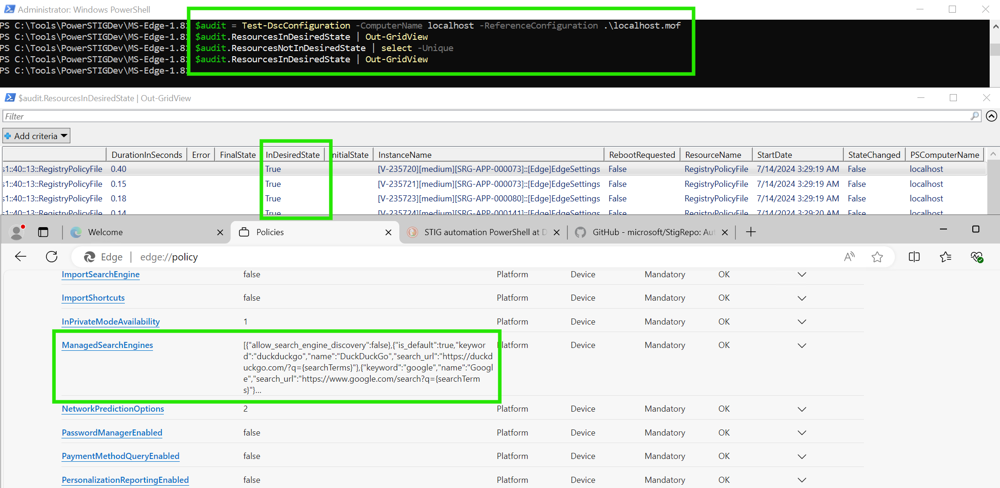

# Get Started with PowerSTIG

Use PowerSTIG to automate STIG compliance across a number of  items like WindowsServer, IIS, Adobe, Chrome, RHEL, Ubuntu, Vsphere, SqlServer, and more, while maintaining documentation of the state as a PowerShell configuration file. This is similar to my approach of [using Ansible tags to maintain and combine machine states](https://github.com/straysheep-dev/ansible-configs/tree/main/inventory_openscap_utils).

*Updated on 2024/07/15.*

<!-- more -->

- [PowerSTIG: Wiki](https://github.com/Microsoft/PowerStig/wiki/home)
- [PowerSTIG: GitHub](https://github.com/Microsoft/PowerStig)

The documentation is fairly in depth, but if you don't know how to use [DSC](https://learn.microsoft.com/en-us/powershell/dsc/getting-started/wingettingstarted?view=dsc-1.1) or the related Windows-centric DevOps tools, the documentation can become incredibly hard to follow and non-linear. This walkthrough is meant to show you how to install PowerSTIG and get a machine into the required state in a clean, easy to understand way.


## Install

Install the module from the PowerShell gallery. You'll be prompted to trust the PSGallery (all remote repos are untrusted by default). Then [install the required DSC resources](https://github.com/Microsoft/PowerStig/wiki/DscGettingStarted). Use this exact command block on the "controller node" (if you're used to Ansible's language) as well as all remote nodes you're applying changes to via PSRemoting. ***PowerSTIG must be installed on each endpoint that will be configured***.

```powershell
Install-Module PowerSTIG -Scope CurrentUser

(Get-Module PowerStig -ListAvailable).RequiredModules | % {
   $PSItem | Install-Module -Force
}
```


## Paths

You'll find everything in the following paths:

```powershell
# PowerSTIG Base Path
C:\Users\Administrator\Documents\WindowsPowerShell\Modules\PowerSTIG

# Raw STIG XML Data, where 4.22.0 is this PowerSTIG version
C:\Users\Administrator\Documents\WindowsPowerShell\Modules\PowerSTIG\4.22.0\StigData\Processed
```

Under `StigData\Processed` you'll find each policy has two related files:

- `POLICY_NAME.org.default.xml`: Commented options, where there's no one default value. Copy this file to a central location
- `POLICY_NAME.xml`: The rest of the rules in the policy with default values

!!! tip "Working Folder for Custom Policy Files"

	A good way to store these is by creating a folder for each policy. The DSC script modules expect paths to files, rather than the files themselves. Separating these configurations by folder will reduce headaches when working with multiple policies.

```powershell
# List all unique policies
$PowerStigVersion = (Get-Module PowerStig -ListAvailable).Version.ToString()
$StigDataPath = "C:\Users\Administrator\Documents\WindowsPowerShell\Modules\PowerSTIG\$PowerStigVersion\StigData\Processed\"
#(gci -Path $StigDataPath | Split-Path -Leaf).Replace(".xml","").Replace(".org.default","") | sort -Unique

# Create a folder for WindowsServer-2022-MS-1.5, WindowsDefender-All-2.4, WindowsFirewall-All-2.2
$PolicyFileList = @("WindowsServer-2022-MS-1.5","WindowsServer-2022-DC-1.5","WindowsDefender-All-2.4","WindowsFirewall-All-2.2")
foreach ($PolicyFile in $PolicyFileList) {
	$DevPath = "C:\Tools\PowerSTIGDev\$PolicyFile"
	New-Item -Type Directory -Path $DevPath 2>$nul
	Copy-Item $StigDataPath$PolicyFile.org.default.xml -Destination $DevPath
}
```


!!! example "Organizational Settings"

	This is a customized [organization file example for Microsoft Edge](https://github.com/microsoft/PowerStig/blob/dev/source/StigData/Processed/MS-Edge-1.8.org.default.xml). It uses DuckDuckGo and Google as the defined search engines.

	```xml
	<!--
		The organizational settings file is used to define the local organizations
		preferred setting within an allowed range of the STIG.

		Each setting in this file is linked by STIG ID and the valid range is in an
		associated comment.

		Modified to use DuckDuckGo instead of Bing
	-->
	<OrganizationalSettings fullversion="1.8">
		<!-- Ensure 'V-235719' is reviewed for needed configuration settings -->
		<OrganizationalSetting id="V-235719" ValueData="" />
		<!-- Ensure all of the search URLs in the list begin with "https" -->
		<OrganizationalSetting id="V-235726" ValueData='[{"allow_search_engine_discovery": false},{"is_default": true,"name": "DuckDuckGo","keyword": "duckduckgo","search_url": "https://duckduckgo.com/?q={searchTerms}"},{"name": "Google","keyword": "google","search_url": "https://www.google.com/search?q={searchTerms}"}]' />
		<!-- Ensure 'V-235752' is 1 or 2 or 3 -->
		<OrganizationalSetting id="V-235752" ValueData="2" />
		<!-- Ensure 'V-235766' is 2 or 3 -->
		<OrganizationalSetting id="V-235766" ValueData="3" />
	</OrganizationalSettings>
	```


## WinRM

Configure each node for WinRM with the following. ***This will open the machine to external connections with a firewall rule***.

```powershell
# Set basic winrm settings
winrm quickconfig

# Get the name of the public profile
Get-NetConnectionProfile

# Update the InterfaceAlias parameter with the name of the profile from above
Set-NetConnectionProfile -InterfaceAlias 'Ethernet' -NetworkCategory Private

# Update the WSMAN MaxEnvelopeSizekb
Set-Item -Path WSMan:\localhost\MaxEnvelopeSizekb -Value 8192
```

!!! error "MaxEnvelopeSizekb"

	See the bottom of [this page](https://github.com/Microsoft/PowerStig/wiki/DscGettingStarted) for details.

	You may receive the error (especially after applying a STIG):

    ```
    The WinRM client sent a request to the remote WS-Management service and was notified that the request size exceeded the configured MaxEnvelopeSize quota.
    ```

    To resolve this, do:

    ```powershell
    # Update the WSMAN MaxEnvelopeSizekb
	Set-Item -Path WSMan:\localhost\MaxEnvelopeSizekb -Value 8192
    ```

!!! error "Access Denied / The user name or password is incorrect"

	PSRemoting can be tricky to get working. Be sure in additon to the above steps you're using an FQDN for the `-ComputerName`, as well as checking if the HTTP SPN exists for that machine.

    ```powershell
    # Where HOSTNAME is the target machine you're trying to remote into
    setspn -A HTTP/HOSTNAME.domain.internal HOSTNAME
	setspn -A HTTP/HOSTNAME HOSTNAME
    ```


## PSRemoting over SSH

*⚠️ This section still needs tested. Theoretically it works since later versions of PowerShell understand PSRemoting over SSH.*

1. [Install winget](https://learn.microsoft.com/en-us/windows/package-manager/winget/#install-winget-on-windows-sandbox) (Copy / paste the entire block)
2. [Install the latest version of PowerShell](https://learn.microsoft.com/en-us/powershell/scripting/install/installing-powershell-on-windows?view=powershell-7.4#install-powershell-using-winget-recommended) `winget install --id Microsoft.Powershell --source winget`
3. [Install OpenSSH-Server](https://github.com/straysheep-dev/windows-configs/blob/main/Manage-OpenSSHServer.ps1)
4. [Enable the PowerShell subsystem in OpenSSH-Server](https://learn.microsoft.com/en-us/powershell/scripting/security/remoting/ssh-remoting-in-powershell?view=powershell-7.4) (see the code snippet below)
5. Create a public / private keypair and load it into your ssh-agent

```powershell
# Enable the PowerShell subsystem in OpenSSH-Server
echo 'Subsystem powershell c:/progra~1/powershell/7/pwsh.exe -sshs -nologo' | Out-File -Path $env:ProgramData\ssh\sshd_config -Encoding ASCII -Append
Restart-Service sshd
```


## Backup and Revert

[PowerSTIG 4.10.0 and later has the ability to create a backup reference point based on a STIG profile you'll be applying, so it knows what to revert to](https://github.com/Microsoft/PowerStig/wiki/Backup-and-Revert).

Create the backup.

```powershell
$DevPath = "C:\Tools\PowerSTIGDev"
$Policy = "WindowsServer-2022-DC-1.5"
Backup-StigSettings -BackupLocation $DevPath\$Policy  -StigName $Policy
```

Revert the system's state.

```powershell
$Policy = "WindowsServer-2022-DC-1.5"
Restore-StigSettings -StigName $Policy
```


## Compile MOF

To compile and maintain MOF-based ([Managed Object Format](https://learn.microsoft.com/en-us/windows/win32/wmisdk/managed-object-format--mof-)) resources, [use a PowerShell script module](https://learn.microsoft.com/en-us/powershell/dsc/how-tos/resources/authoring/mof-based?view=dsc-2.0#writing-the-script-module). This script module was created from one of the examples for [WindowsServer](https://github.com/Microsoft/PowerStig/wiki/WindowsServer) under the wiki's [Composite Resources](https://github.com/Microsoft/PowerStig/wiki/CompositeResources).

- [WindowsDefender Configuration Script Module Examples](https://github.com/Microsoft/PowerStig/wiki/WindowsDefender#examples)
- [WindowsFirewall Configuration Script Module Examples](https://github.com/Microsoft/PowerStig/wiki/WindowsFirewall#examples)

Write this to a file such as `C:\Tools\PowerSTIGDev\WindowsServer-2022-MS-1.5\WindowsServer2022-MS-1.5.ps1` and run it to generate the MOF file of `localhost.mof`. The MOF file is written to the `OutputPath` based on the line at the bottom of the script: `Example -OutputPath C:\Tools\PowerSTIGDev\WindowsServer-2022-MS-1.5`.

```powershell
<#
    Use embedded STIG data while skipping rules and inject exception data.
    Example for baselining WindowsServer 2022 that isn't a DC.
#>

configuration Example
{
    param
    (
        [parameter()]
        [string]
        $NodeName = 'localhost'
    )

    Import-DscResource -ModuleName PowerStig

    Node $NodeName
    {
        WindowsServer BaseLine
        {
            OsVersion   = '2022'
            OsRole      = 'MS'
            StigVersion = '1.5'
            # Domain and Forest don't need specified if you're already domain joined, unless you're scanning cross-forest
            #DomainName  = 'sample.test'
            #ForestName  = 'sample.test'
            #Exception   = @{'V-1075'= @{'ValueData'='1'} }
            # Rules '254442-4' Involve DoD certificates which we won't have access to
            # Rule 'V-254254.c' breaks on WindowsServer 2022: https://github.com/microsoft/PowerStig/issues/1360#issuecomment-2176146847
            # Rule 'V-254439' denies interactive logon for Enterprise Admins,Domain Admins,Local account,Guests this can interfere when testing
            SkipRule = @('V-254442','V-254443','V-254444','V-254254.c','V-254439')
            OrgSettings = "C:\Tools\PowerSTIGDev\WindowsServer-2022-MS-1.5\WindowsServer-2022-MS-1.5.org.default.xml"
        }
    }
}

Example -OutputPath C:\Tools\PowerSTIGDev\WindowsServer-2022-MS-1.5
```

!!! warning "Encountering Errors"

	In writing this guide, an issue was encountered with the WindowsServer2022 MS STIG 1.5 policy. [The fix was to skip rule `V-254254.c`](https://github.com/microsoft/PowerStig/issues/1360#issuecomment-2176146847), as this should only apply to Domain Controllers (DC, not MS). Any easy way to `tail -F /var/log/syslog` and get a sense of what's happening is with [Tail-EventLogs.ps1](https://github.com/straysheep-dev/windows-configs/blob/main/Tail-EventLogs.ps1).

    ```powershell
    iex(New-Object Net.WebClient).DownloadString('https://github.com/straysheep-dev/windows-configs/raw/main/Tail-EventLogs.ps1');
    Tail-EventLog -LogName Microsoft-Windows-DSC/Operational
    ```

    Have this running in another PowerShell tab to monitor logs related to DSC.

    Similarly, if using the DC 1.5 policy, be sure your machine's `hostname` is valid, and use your DC's FQDN below for `-ComputerName` when running audits or setting the state.

Here's what your working folder should look like now:

```powershell
    Directory: C:\Tools\PowerSTIGDev\WindowsServer-2022-MS-1.5


Mode                 LastWriteTime         Length Name
----                 -------------         ------ ----
-a----         7/13/2024  11:46 PM         312314 localhost.mof
-a----         7/13/2024  11:30 PM           5775 WindowsServer-2022-MS-1.5.org.default.xml
-a----         7/13/2024  11:46 PM            812 WindowsServer2022-MS-1.5.ps1
```


## Audit a Policy

Check the localhost's current state against the policy, and load the results into a variable called `$audit`. This is useful to do first, so you can check which rules will need applied to your machine. Then you can determine if they will impact functionality or not.

```powershell
# Local mof file
$audit = Test-DscConfiguration -ComputerName localhost -ReferenceConfiguration C:\Tools\PowerSTIGDev\WindowsServer-2022-MS-1.5\localhost.mof
# Shared mof file, must be scripted and automated or done interactively from client
$audit = Test-DscConfiguration -ComputerName localhost -ReferenceConfiguration \\dc01.domain.internal\PowerSTIGDev\WindowsClient-11-1.6\localhost.mof

# View compliant settings
$audit.ResourcesInDesiredState | Out-GridView

# View non-compliant settings
$audit.ResourcesNotInDesiredState | Out-GridView

# Save results
$audit.ResourcesInDesiredState | Out-File -FilePath C:\Tools\PowerSTIGDev\WindowsServer-2022-MS-1.5\ResourcesInDesiredState.log -Encoding ASCII
$audit.ResourcesNotInDesiredState | Out-File -FilePath C:\Tools\PowerSTIGDev\WindowsServer-2022-MS-1.5\ResourcesNotInDesiredState.log -Encoding ASCII
```

This is an example of what the `Out-GridView` looks like (behind the MS Edge window).




## Apply a Policy

- [Apply a configuration (MOF) document to a machine](https://learn.microsoft.com/en-us/powershell/dsc/getting-started/wingettingstarted?view=dsc-1.1&viewFallbackFrom=powershell-5.1#apply-the-configuration-to-the-machine)

What can be confusing is `-Path` requires a path to where the `.mof` file lives, not a full path of the `.mof` file.

```powershell
Start-DscConfiguration -ComputerName localhost -Path C:\Tools\PowerSTIGDev\WindowsServer-2022-MS-1.5 -Wait -Verbose
```

This will start a background job and apply the machine state. You may need to reboot to apply every change.


### Remote Automation

This can also be confusing if you're familiar with Ansible, which uses the locally installed copy of python over ssh on each endpoint to perform module tasks without an agent. In this sense, PSRemoting can't leverage the "controller" node's PowerSTIG module. **PowerSTIG must exist on each endpoint to work**. Deployment ultimately could be done with a GPO to pull the MOF file from the DC (or a fileshare). Interactively trying to test your actions and reach the DC via PSRemoting results in the double-hop problem. You'll have to test this over RDP from one client.

- Each endpoint needs PowerSTIG installed
- The [DSCEA tool mentioned](https://github.com/Microsoft/PowerStig/wiki/GettingStarted#deploy-dsc-resources) is only for auditing and reporting, not configuring states
- You're effectively configuring each endpoint to pull the MOF file and run it on "localhost", vs running a module on an inventory

Create the SMB share.

```powershell
$Parameters = @{
    Name = 'PowerSTIGDev'
    Path = 'C:\Tools\PowerSTIGDev'
    FullAccess = 'Contoso\Administrator', 'Contoso\Contoso-DEV1$'
    ReadAccess = 'Everyone'
}
New-SmbShare @Parameters
```

Write the deployment script to `\\DOMAIN\SYSVOL`, or in some format so a GPO can tell each domain-joined host in scope to pull these files, and run PowerSTIG locally based on the machine's role. The example below is a very simplified way of doing this, checking if the machine is a Workstation or DomainController before applying a STIG policy.

```powershell
<#
  Applies STIG states to domain-joined endpoints.
  Can be configured to run via a logon script with a GPO or similar.
#>


if ((Get-ComputerInfo).OsProductType -eq "Workstation") {

	Start-DscConfiguration -ComputerName localhost -Path \\dc01.domain.internal\PowerSTIGDev\WindowsClient-11-1.6\

} elseif ((Get-ComputerInfo).OsProductType -eq "DomainController") {

	Start-DscConfiguration -ComputerName localhost -Path \\dc01.domain.internal\PowerSTIGDev\WindowsServer-2022-DC-1.5\

}
```

!!! tip "Group Policy"

    This is much better handled through an organized Group Policy. For instance if you have all of your DNS servers grouped together, then create a GPO linked to only that OU to execute PowerSTIG's DNS profile.

    In this case you don't need any script logic, the machines just need access to the correct MOF / PowerSTIG files.
